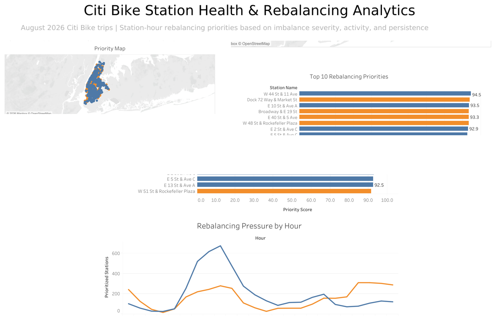

# Citi Bike Station Health & Rebalancing Analytics

## Dashboard Preview



### [View the Interactive Tableau Dashboard](https://public.tableau.com/views/CitiBike_Rebalancing_Analytics_Final/1?:language=zh-CN&:sid=&:redirect=auth&:display_count=n&:origin=viz_share_link)

## Project Overview

This project analyzes **5,246,236 Citi Bike trips from August 2026** to identify station-hour rebalancing priorities across New York City.

The analysis is designed around three operational questions:

- **Where** is bike- or dock-availability pressure concentrated?
- **Which stations** should receive attention first at a selected hour?
- **When** is rebalancing pressure highest throughout the day?

Rather than treating unusual patterns as immediate operational problems, the project follows a **data-quality-first workflow**. Station identities, trip behavior, and KPI definitions are validated before generating operational recommendations.

## Business Question

**How can Citi Bike trip data be transformed into a reliable station-hour prioritization framework for rebalancing decisions?**

The objective is not to predict exact bike inventory. Instead, the project uses trip-flow patterns to identify station-hours that may deserve greater operational attention.

## Tools

- **DuckDB** — querying and aggregating 5M+ trip records
- **Python** — analysis workflow and validation
- **Tableau** — interactive operational dashboard
- **Google Drive / Colab** — data storage and analysis environment

## Data

- **Source:** Citi Bike trip data
- **Period:** August 2026
- **Raw files:** 6 CSV files
- **Trips analyzed:** **5,246,236**
- **Raw-data grain:** one row per bike trip
- **Operational analysis grain:** station × date × hour

The raw trip files are not included in this repository because of their size.

## Data Quality First

A major focus of this project was determining whether apparent operational problems were real mobility patterns or artifacts of the underlying data.

Two important QA areas were investigated:

1. Trip-duration behavior
2. Station-identifier consistency

This mattered because inaccurate data could directly distort downstream rebalancing KPIs and lead to incorrect operational conclusions.

## Trip Duration Quality Audit

Trip durations were profiled before making any filtering decision.

Key results:

- **Median trip duration:** 9.78 minutes
- **99th percentile:** 65.83 minutes
- **Trips longer than 4 hours:** 4,286

Long-duration trips were flagged for review rather than automatically removed.

The guiding principle was:

> **Unusual does not automatically mean invalid.**

Automatically deleting every long-duration trip could remove legitimate rides and introduce unnecessary bias into the analysis.

## Station Entity Resolution

One of the most important findings came from station-ID validation.

Some stations initially appeared to have extreme one-way flow patterns, suggesting severe bike- or dock-availability pressure.

Further investigation showed that some physical stations were represented by multiple station-ID formats.

For example:

- `5343.1`
- `5343.10`

These identifiers referred to the same physical station location, but the trip records were split across two IDs.

Before normalization:

- one ID appeared strongly arrival-dominant
- the other appeared strongly departure-dominant

After resolving the two IDs into one canonical station key:

- **Arrivals:** 7,605
- **Departures:** 7,497

The apparent extreme imbalance largely disappeared.

This demonstrated an important analytical lesson:

> **A data-quality problem can create a false business signal.**

Without entity resolution, an operations team could incorrectly prioritize a station for rebalancing.

## Canonical Station Key

Station IDs were normalized before downstream KPI construction.

The normalization logic was designed to handle cases such as:

- `5343.1` → `5343.10`
- `5343.10` → `5343.10`
- `5303.06_` → `5303.06`

At the same time, legitimate alphanumeric station IDs such as:

- `SYS016`
- `HB103`
- `JC002`

were preserved.

This avoided the mistake of simply converting every station ID to a numeric value.

## Station-Hour Aggregation

Trip-level data was transformed into a **station × date × hour** analytical structure.

For each station-hour, the workflow calculated:

- Arrivals
- Departures
- Net flow
- Total activity
- Imbalance rate
- Bike-pressure flag
- Dock-pressure flag

Definitions:

```text
Net Flow = Arrivals - Departures

Total Activity = Arrivals + Departures

Imbalance Rate = Net Flow / Total Activity
